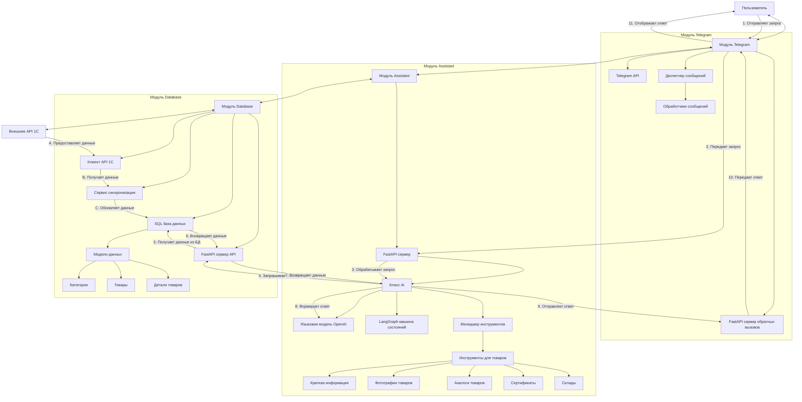

# Детальный анализ проекта SDS Assistant

## Общее описание проекта

SDS Assistant представляет собой интеллектуальную систему для обработки запросов о товарах в онлайн-магазине. Система построена на микросервисной архитектуре и состоит из трех основных модулей, каждый из которых выполняет специфические функции в рамках общего рабочего процесса.

## Детальное описание модулей

### 1. Модуль Telegram (telegram)

**Основная функциональность:**
- Обеспечивает пользовательский интерфейс через Telegram бота
- Обрабатывает сообщения и команды пользователей
- Передает запросы пользователей в модуль Assistant
- Получает и отображает ответы пользователям

**Компоненты модуля:**
- **Bot и Dispatcher** - основные компоненты для взаимодействия с Telegram API
- **Router** - маршрутизатор сообщений и команд
- **FastAPI сервер** - обрабатывает обратные вызовы от модуля Assistant
- **Обработчики сообщений** - асинхронные функции для обработки различных типов сообщений

**Технические детали:**
- Использует библиотеку `aiogram` для взаимодействия с Telegram API
- Реализует асинхронную обработку сообщений для эффективной работы с множеством пользователей
- Поддерживает механизм обратных вызовов через FastAPI для получения ответов от модуля Assistant
- Отправляет индикаторы набора текста для улучшения пользовательского опыта
- Обрабатывает ошибки и исключения, предоставляя пользователю понятные сообщения

**Процесс обработки запроса:**
1. Пользователь отправляет сообщение боту
2. Сообщение передается в модуль Assistant через HTTP запрос
3. Ответ от Assistant приходит через обратный вызов на FastAPI сервер
4. Бот отправляет полученный ответ пользователю

### 2. Модуль Assistant (assistant)

**Основная функциональность:**
- Обрабатывает запросы пользователей с использованием языковой модели (LLM)
- Управляет состоянием и потоком разговора
- Предоставляет инструменты для поиска товаров и получения информации
- Отправляет ответы обратно в модуль Telegram

**Компоненты модуля:**
- **FastAPI сервер** - принимает запросы от Telegram модуля
- **Ai класс** - основной класс для обработки запросов и управления состоянием
- **LangGraph State Machine** - машина состояний для управления потоком разговора
- **Инструменты (tools)** - набор специализированных функций для поиска и получения информации о товарах
- **Механизм обратных вызовов** - асинхронная система для отправки ответов обратно в Telegram

**Технические детали:**
- Использует `LangChain` и `LangGraph` для управления потоком разговора
- Интегрируется с OpenAI API для обработки естественного языка
- Реализует систему инструментов для различных типов поиска товаров
- Поддерживает сохранение и восстановление состояния разговора
- Обрабатывает ошибки и повторяет запросы при необходимости

**Инструменты для работы с товарами:**
- `get_short_product` - получение краткой информации о товарах
- `get_product_photos_list` - получение списка фотографий товара
- `get_analogs` - поиск аналогов и сопутствующих товаров
- `get_certificates` - получение сертификатов товара
- `get_warehouses` - получение информации о складах
- `get_datetime` - получение текущей даты и времени

**Процесс обработки запроса:**
1. Получение запроса от Telegram модуля
2. Инициализация или восстановление состояния разговора
3. Обработка запроса с использованием LLM и инструментов
4. Формирование ответа на основе результатов обработки
5. Отправка ответа обратно в Telegram модуль через обратный вызов

### 3. Модуль Database (database)

**Основная функциональность:**
- Синхронизирует данные из внешней системы 1C
- Хранит информацию о товарах локально
- Предоставляет API-эндпоинты для модуля Assistant
- Обрабатывает фильтрацию и поиск данных

**Компоненты модуля:**
- **FastAPI сервер (apiServer)** - предоставляет API для доступа к данным
- **Сервис синхронизации данных (DataSync)** - обеспечивает синхронизацию с 1C
- **Клиент API 1C (ApiClient)** - взаимодействует с внешним API 1C
- **Модели данных (db)** - определяют структуру хранимых данных
- **База данных** - хранит информацию о товарах

**Технические детали:**
- Использует SQLAlchemy ORM для работы с базой данных
- Реализует механизм массового обновления данных (bulk upsert)
- Поддерживает пагинацию и фильтрацию результатов
- Обрабатывает ошибки и повторяет запросы при сбоях
- Предоставляет идентичные с 1C API эндпоинты для совместимости

**Модели данных:**
- `Category` - категории товаров
- `ProductShort` - краткая информация о товарах
- `ProductFull` - полная информация о товарах
- `Analog` - аналоги и сопутствующие товары
- `Barcode` - штрихкоды и упаковки
- `EtimClass` и `EtimProduct` - ETIM классификация товаров
- `Certificate` - сертификаты товаров
- `Photo` - фотографии товаров
- `Instruction` - инструкции
- `Warehouse` - информация о складах

**Процесс синхронизации данных:**
1. Инициализация соединения с базой данных и API 1C
2. Последовательная загрузка данных по каждой категории (категории, товары, аналоги и т.д.)
3. Обработка и фильтрация полученных данных
4. Массовое обновление данных в локальной базе данных
5. Обработка ошибок и повторные попытки при сбоях

## Детальная диаграмма взаимодействия модулей

## Детальное описание процесса обработки запроса пользователя

1. **Инициация запроса**
   - Пользователь отправляет сообщение боту в Telegram

2. **Передача запроса в модуль Assistant**
   - Telegram модуль формирует HTTP запрос с текстом сообщения, ID пользователя и URL для обратного вызова
   - Запрос отправляется на FastAPI сервер модуля Assistant

3. **Обработка запроса в модуле Assistant**
   - FastAPI сервер получает запрос и передает его в класс Ai
   - Класс Ai инициализирует или восстанавливает состояние разговора
   - Запрос обрабатывается с использованием LangGraph машины состояний
   - Языковая модель анализирует запрос и определяет необходимые действия

4. **Использование инструментов для получения данных**
   - Если требуется информация о товарах, вызываются соответствующие инструменты
   - Инструменты формируют запросы к модулю Database через API

5. **Получение данных из модуля Database**
   - FastAPI сервер модуля Database получает запрос
   - Запрос обрабатывается и выполняется поиск в базе данных
   - Результаты фильтруются и возвращаются в модуль Assistant

6. **Формирование ответа**
   - Модуль Assistant получает данные и передает их языковой модели
   - Языковая модель формирует ответ на естественном языке
   - Ответ обрабатывается и подготавливается к отправке

7. **Отправка ответа пользователю**
   - Модуль Assistant отправляет ответ через обратный вызов на FastAPI сервер модуля Telegram
   - Модуль Telegram получает ответ и отправляет его пользователю в чат
   - Пользователь получает ответ на свой запрос

## Технологический стек

### Общие технологии
- **Python** - основной язык программирования
- **FastAPI** - веб-фреймворк для API эндпоинтов
- **Uvicorn** - ASGI сервер
- **aiohttp** - асинхронный HTTP клиент/сервер
- **python-dotenv** - управление переменными окружения

### Модуль Telegram
- **aiogram** - фреймворк для разработки Telegram ботов
- **Telegram Bot API** - API для взаимодействия с Telegram

### Модуль Assistant
- **LangChain** - фреймворк для приложений на основе LLM
- **LangGraph** - инструмент для создания приложений с состоянием на основе LLM
- **OpenAI API** - провайдер языковой модели

### Модуль Database
- **SQLAlchemy** - ORM для работы с базой данных
- **PyMySQL** - драйвер для работы с MySQL
- **MySQL** - реляционная база данных

## Преимущества и недостатки архитектуры

### Преимущества

1. **Модульная архитектура** - система разделена на три четких модуля с ясными обязанностями, что упрощает поддержку и расширение.

2. **Асинхронный дизайн** - использование async/await позволяет эффективно обрабатывать параллельные запросы.

3. **Управление состоянием разговора** - реализация LangGraph позволяет вести сложные, многоэтапные диалоги с пользователями.

4. **Надежная обработка ошибок** - код включает комплексную обработку ошибок и механизмы повторных попыток.

5. **Масштабируемая база данных** - модуль базы данных может эффективно обрабатывать большие каталоги товаров благодаря пагинации и фильтрации.

6. **Гибкие инструменты поиска** - ассистент имеет несколько специализированных инструментов для различных типов поиска товаров.

7. **Механизм обратных вызовов** - асинхронная система обратных вызовов позволяет неблокирующую работу при обработке длительных запросов.

### Недостатки

1. **Зависимость от внешних сервисов** - система сильно зависит от внешних сервисов (OpenAI API, 1C API), которые могут стать точками отказа.

2. **Ограниченная поддержка платформ** - в настоящее время поддерживается только Telegram в качестве пользовательского интерфейса.

3. **Накладные расходы на синхронизацию** - синхронизация данных из 1C может стать узким местом при работе с большими наборами данных.

4. **Жестко закодированная конечная точка API** - конечная точка API 1C жестко закодирована в классе ApiClient, а не настраивается через конфигурацию.

5. **Ограниченная аутентификация** - механизм аутентификации для API основан на простых токенах, что может быть недостаточно для высокочувствительных данных.

6. **Отсутствие механизма кэширования** - нет очевидной стратегии кэширования для часто запрашиваемых данных.

7. **Ограниченный мониторинг** - система не имеет комплексных возможностей логирования и мониторинга помимо базового логирования ошибок.

## Заключение

Проект SDS Assistant представляет собой хорошо спроектированную, модульную систему, которая использует современные возможности искусственного интеллекта для предоставления интеллектуальной помощи по товарам. Его архитектура следует хорошим практикам разделения ответственности и асинхронной обработки. Основные сильные стороны заключаются в гибком управлении разговором и комплексной обработке данных о товарах.

Области для улучшения включают добавление большего количества вариантов пользовательского интерфейса помимо Telegram, реализацию стратегий кэширования, улучшение мер безопасности и добавление более надежного мониторинга и ограничения скорости. В целом, проект обеспечивает прочную основу, которую можно расширять и улучшать для более продвинутых возможностей помощника в электронной коммерции.
